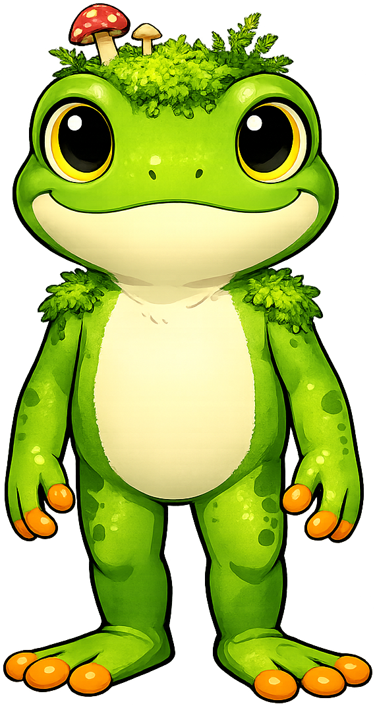
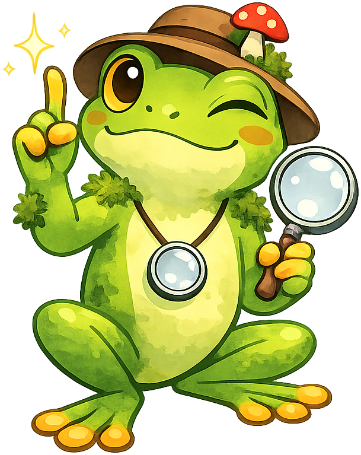
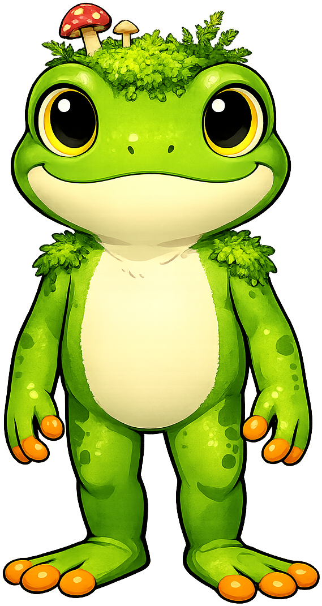

# Mossby the Tree Frog - Mascot Test

This page shows all mascot images as well as the admonition styles for reference. Check that all the images have a transparent background
and do not have excessive padding around the drawing.
Note that the images have a dashed blue border around them so you can clearly see the padding.

## Image Tests

1. Welcome
{ width="150px"}
2. Thinking
{ width="150px"}
3. Tip
{ width="150px"}
4. Warning
{ width="150px"}
5. Encouraging
{ width="150px"}
6. Celebration
{ width="150px"}
7. Neutral
{ width="150px"}

## Admonition Tests

!!! mascot-welcome "Mossby Welcomes You!"
    
    Welcome, explorers! I'm Mossby the Tree Frog, your guide through
    the fascinating world of moss — from biology and ecology to garden design
    and sustainability. Let's hop to it!

!!! mascot-thinking "Key Insight"
    
    Notice that moss thrives without roots, seeds, or vascular tissue.
    Understanding how moss absorbs water through capillary action alone
    reveals just how different these ancient plants are from everything
    else in your garden.

!!! mascot-tip "Mossby's Tip"
    
    When identifying moss in the field, start by checking the growth form.
    Does it grow upright in cushions (acrocarpous) or spread flat in sheets
    (pleurocarpous)? That single observation narrows your options dramatically.

!!! mascot-warning "Common Mistake"
    
    Don't overwater your mossarium! Moss needs consistent humidity, not
    standing water. A closed mossarium should only need misting every few
    weeks. If you see pooling water at the bottom, you've added too much.

!!! mascot-encourage "You've Got This!"
    
    Learning to tell moss species apart can feel overwhelming at first —
    there are over 12,000 species worldwide! Start with just five common
    types and build from there. Every expert started exactly where you are.

!!! mascot-celebration "Excellent Work!"
    
    You've just completed the ecology section — from water retention
    to carbon sequestration to the moss microbiome. You now understand
    how these tiny plants shape entire ecosystems. Outstanding work, explorer!

!!! mascot-neutral "A Note from Mossby"
    
    This course covers a lot of ground — from moss cell biology to space
    habitats. Each chapter builds on the last, so if something feels shaky,
    it's worth going back to reinforce it before hopping forward.
